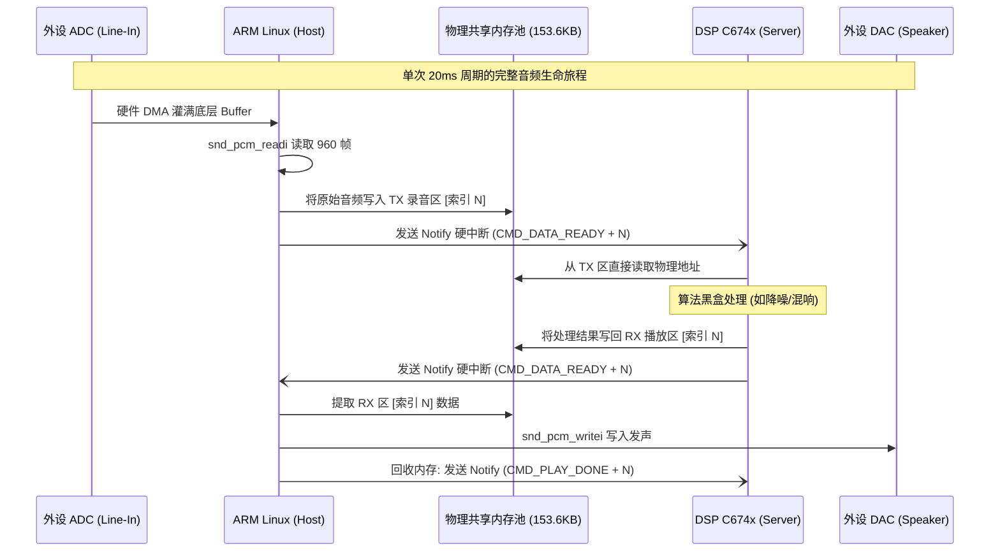
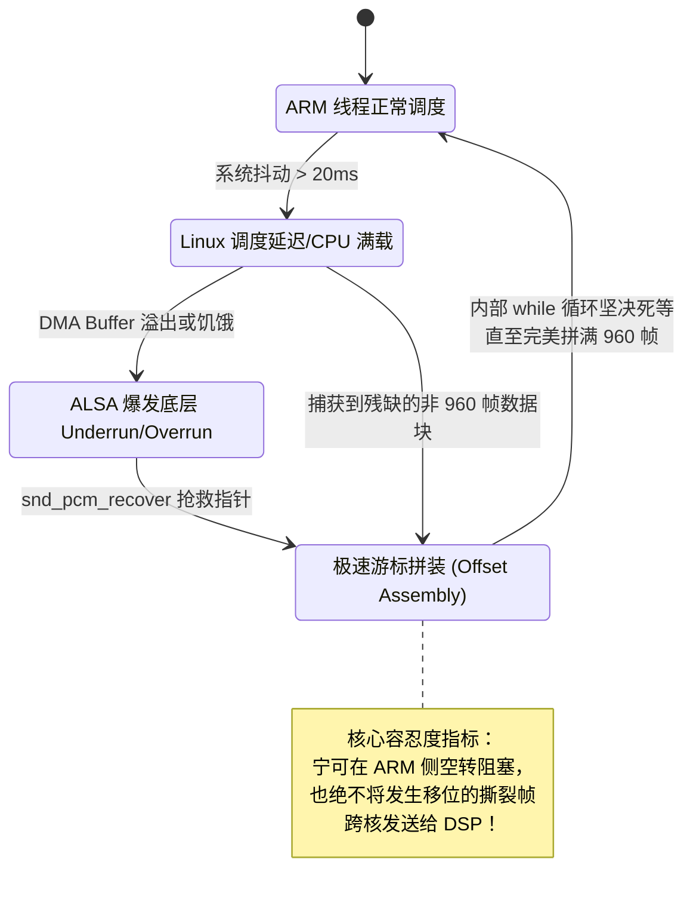

# DM8168 异构多核音频流控系统需求规格说明书 (SRS)

## 1. 项目立项背景 (Project Background)

随着声学前端处理技术的发展，诸如远场语音识别、自适应回声消除 (AEC) 等重型算法对算力的要求日益苛刻。传统的单核 ARM Linux 在应对百毫秒级的操作系统调度抖动时，往往会导致音频流的严重撕裂。
为解决此问题，本系统依托 DM8168 (ARM Cortex-A8 + DSP C674x) 的非对称多处理 (AMP) 硬件特性，确立了**“ARM 专职流控搬运 + DSP 专职硬实时算力”**的系统需求。

---

## 2. 系统核心角色与用例分析 (Use Case Analysis)

系统主要由四大实体构成，它们各自承担绝对隔离的职责。

```mermaid
usecaseDiagram
    actor External as 外部世界 (ADC/DAC, 麦克风/扬声器)
    actor Algorithm as 算法工程师 (二次开发)
    
    package "DM8168 双核系统架构" {
        usecase "ARM 搬运核心" as UC_ARM
        usecase "SysLink IPC 桥梁" as UC_IPC
        usecase "DSP 运算核心" as UC_DSP
        
        External --> UC_ARM : 提供/接收 16-bit PCM 流
        UC_ARM --> UC_IPC : 封包、拼装、触发中断
        UC_IPC --> UC_DSP : 物理内存零拷贝直达
        UC_DSP --> Algorithm : 提供纯粹的 (in, out, len) 指针入口
    }
```

---

## 3. 功能性需求与数据流 (Functional Requirements & Data Flow)

### 3.1 严格声学参数硬性要求
*   **采样率锁定**：系统必须强制锁定为 **48,000 Hz** (专业演播室级别)。
*   **数据格式**：支持 **Signed 16-bit Little Endian (S16_LE)** 与 **双声道 (Stereo)**。
*   **双全工无感直通**：必须实现 `Capture -> ARM -> DSP -> ARM -> Playback` 的完美闭环。

### 3.2 零拷贝双核通信数据流全景图 (End-to-End Data Flow)
严禁在 ARM 与 DSP 之间使用消耗 CPU 的逻辑拷贝 (如 Sockets)。所有数据必须通过直接的物理内存指针进行移交。



---

## 4. 非功能性需求：容灾与自愈 (Non-Functional Requirements: Robustness)

本系统必须满足极度严苛的工业级抗灾指标，要求在遭遇系统级抖动时具备**自愈能力**。

### 4.1 异常容灾状态机 (Fault Tolerance State Machine)
在系统 CPU 负载飙升至 100%、Linux 调度器出现大规模停滞的恶劣工况下，系统需按如下状态机进行自愈：



### 4.2 量化容灾指标基线
1.  **超深缓冲池抗抖动 (Jitter Resistance)**：底层 DMA 的 `SHARED_REGION_1` 缓冲深度必须达到 **400 毫秒** (即 20 个块)。即便 Linux 死锁 300 毫秒，底层绝不断流。
2.  **冷启动预充水 (Pre-charging)**：强制要求 ALSA 在积攒至少 **60 毫秒 (3 个周期)** 数据前，关闭发声引擎，杜绝启动首秒的缺水“叭”声爆音。
3.  **防僵尸进程 (Anti-Zombie IPC)**：支持通过 **`Enter 键`** 发出优雅注销信号。在 1 秒内必须完成 `打破 ALSA 阻塞 -> 解除信号量 -> DSP 挥手确认 -> 彻底销毁内存`。要求支持 100 次以上的极速启停而不发生内核死锁。
