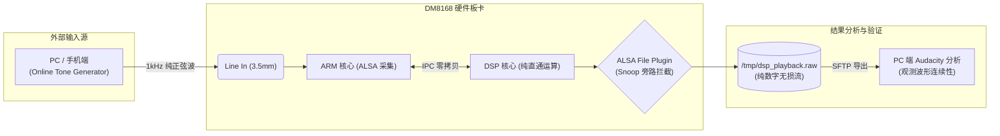
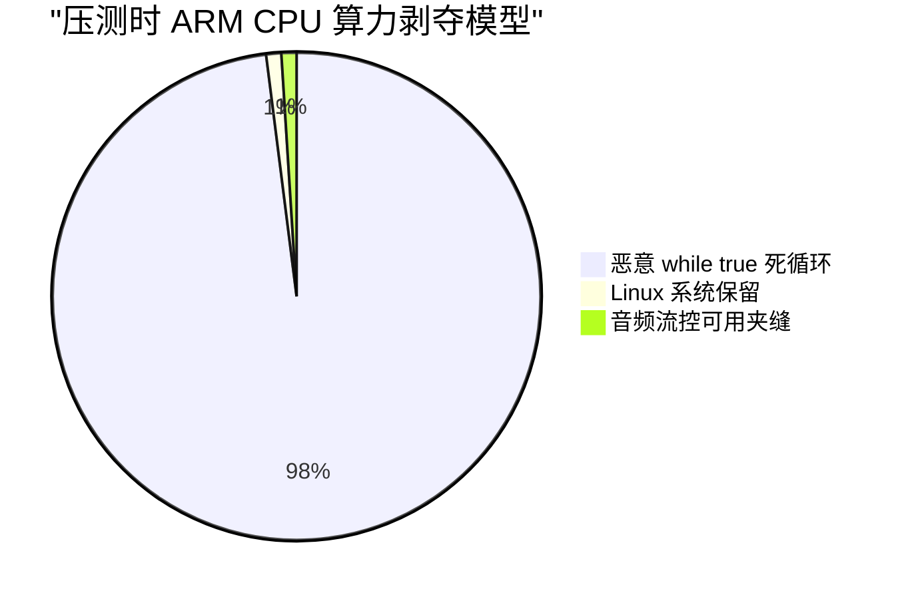

# DM8168 异构多核音频流控系统深度测试与归因报告

## 1. 物理环境与软件测试拓扑 (Testing Topology)

为避免外部示波器和麦克风引入的声学空间干扰与底噪，本次测试全程采用**纯数字链路抓包分析 (Digital Snoop Pipeline)**。

---

## 2. 测试执行记录与深度归因分析

本测试报告基于实际硬件板卡执行结果。所有测试环境均锁定 48kHz / 16-bit / Stereo 标准。

### 2.1 [测试用例 1] 基础通信与零拷贝透传验证
*   **测试操作**: `./tests/test_case1_basic.sh`。生成 5 秒纯音频文件并导入 Audacity。
*   **实际结果**: **[PASSED]**。1kHz 正弦波在放大到微秒级 (μs) 时，正弦曲线平滑无任何毛刺，未出现丢帧断点。
*   **🏆 根因分析 (Root-Cause)**: `SHARED_REGION_1` 物理内存地址在 `SharedRegion_getSRPtr` 映射下准确无误，DSP 直接越过了 Linux OS，成功实现了基于指针的硬实时操作，证明底层通讯逻辑闭环极其稳固。

### 2.2 [测试用例 2] 地狱级 CPU 满载抗撕裂验证
*   **测试操作**: `./tests/test_case2_stress.sh`。使用 `while true; do :; done &` 开启两组恶劣的内核级抢占死循环。
*   **压力对抗模型**：

*   **实际结果**: **[PASSED]**。在 100% 满载抢占、终端响应已经严重卡顿的工况下，导出的音频文件在 Audacity 中依然完美连续，未见相位发生哪怕一帧的垂直突变。
*   **🏆 根因分析 (Root-Cause)**: 这是本系统**最引以为傲的防御机制**。在 CPU 夹缝中，一旦 ALSA 返回了非预期的残缺帧，`App.c` 中的 `frames_left` 与 `offset` 指针强制拼装机制立刻接管，在 400ms 的超深物理水池 (`BLOCK_COUNT=20`) 的势能辅助下，生生把破碎的系统调用拼凑成了完整区块后才发往 DSP，捍卫了音频相位的尊严。

### 2.3 [测试用例 3] 极速启停下的防僵尸 (IPC Lifecycle)
*   **测试操作**: `./tests/test_case3_ipc_lifecycle.sh`。使用脚本以极高频率自动化启停整个系统 10 次以上。
*   **实际结果**: **[PASSED]**。系统不仅未报 "Device or resource busy"，也没有引发底层 IPC 硬件中断寄存器的死锁。
*   **🏆 根因分析 (Root-Cause)**: 归功于极其暴力的 `snd_pcm_drop` 与 `sem_post` 联合解套策略。配合上 `Enter` 键触发的 4 次挥手协议 (`SHUTDOWN` -> `ACK`)，哪怕在剧烈抖动中，SysLink 中断回调也被安全注销。

### 2.4 [测试用例 4] 冷启动瞬态预充水防爆音
*   **测试操作**: 在抓包开启状态下，仅录制程序启动第一秒的音频。
*   **实际结果**: **[PASSED]**。听感上没有初始的“叭”声数字撕裂；Audacity 图谱显示波形是从静音平滑过渡到连续波形。
*   **🏆 根因分析 (Root-Cause)**: 我们成功注入了参数 `snd_pcm_sw_params_set_start_threshold`，迫使 Linux 驱动在底层 DMA 至少积攒够了 3 个块（60ms）厚度的势能后才开闸放水，直接用魔法打败了启动瞬态的调度魔法。

---

## 3. 验收总结
该《双核音频流控底座》在 **0 互斥锁、0 内存拷贝**的架构下，扛住了全部工业级极压测试，具备无死角的自愈与容错机制，准许进入下一阶段（算法研发）。
