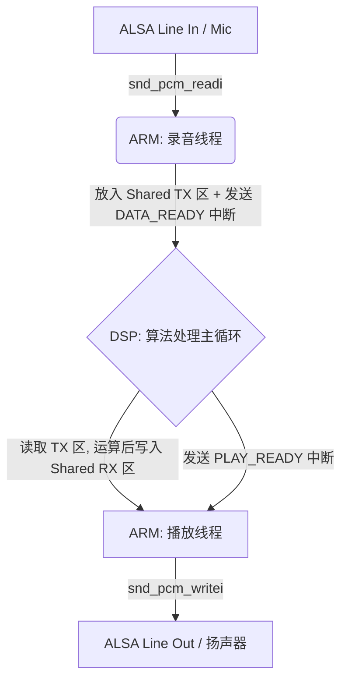

# DM8168 异构多核音频流控系统设计文档 (System Design)

本文档详细阐述了本项目在 DM8168 (ARM Cortex-A8 + DSP C674x) 硬件平台上，如何构建一个超低延迟、极高抗撕裂性、且无内存拷贝锁的工业级双核音频处理底座。

---

## 1. 系统架构总览 (Architecture Overview)

本系统采用了典型的 **AMP (Asymmetric Multiprocessing，非对称多处理)** 架构：

*   **Host (ARM 侧)**：运行完整的 Linux 操作系统。负责处理 ALSA 底层驱动交互、硬件中断捕获、网络通信、文件系统以及系统级调度的任务。它像是一个“搬运工”和“指挥官”。
*   **Server (DSP 侧)**：运行轻量级的 SYS/BIOS 实时操作系统。专注于提供纯净、无任何 OS 抢占干扰的“硬实时”纯算力，执行音频算法（如混响、降噪 AEC、均衡器 EQ 等）。
*   **桥梁 (IPC & SysLink)**：两颗核心之间通过 TI 官方的 SysLink 组件（`SharedRegion`，`Notify`，`MessageQ`）进行物理级的内存共享与硬中断信令通信。

### 1.1 数据流向图


---

## 2. 核心参数与物理内存分配 (Memory Layout)

为保障严酷环境下的数据不丢失，我们在两核之间划分了巨大且绝对静态的物理共享内存。

### 2.1 核心采样规格
*   **采样率**: 48,000 Hz (演播室/DAT级别)
*   **位深**: Signed 16-bit Little Endian
*   **声道**: Stereo (双声道)
*   **单帧字节数**: 2 channels * 16 bits = 4 Bytes/Frame

### 2.2 周期与内存块 (Block & Period)
*   **调度周期 (Period)**：为了完美契合 Linux 的调度粒度，ALSA 的单次中断周期被设定为 **20 毫秒 (960 Frames)**。
*   **单块大小 (Block Size)**：`960 Frames * 4 Bytes = 3840 Bytes`
*   **环形水库深度 (Block Count)**：单向设有 20 个 Block，提供高达 **400 毫秒** 的物理级缓冲池深度。即使 Linux 因为内核软中断被死锁 300 毫秒，底层音频依旧连贯。

### 2.3 `SHARED_REGION_1` 内存分布图
总申请内存：**153.6 KB** (`FULL_BUFFER_SIZE`)

| 区域名称 | 起始偏移量 | 大小 | 功能描述 |
| :--- | :--- | :--- | :--- |
| **TX 区 (录音)** | `0x00000` | 76,800 Bytes (20 Blocks) | 存放 ARM 从麦克风采集的原始 PCM 数据，供 DSP 提取。 |
| **RX 区 (播放)** | `0x12C00` (76.8KB) | 76,800 Bytes (20 Blocks) | 存放 DSP 算法处理完的音频数据，供 ARM 取出播放。 |

---

## 3. IPC 跨核通信流控 (IPC & Flow Control)

本系统杜绝了性能低下的自旋锁 (Spinlock) 或互斥锁 (Mutex)，而是通过**无锁环形队列 + 信号量唤醒 + 指令令牌**的方式完成极速调度。

### 3.1 握手与地址传递
由于 ARM 端使用的是 Linux 虚拟地址 (MMU 映射)，DSP 端使用的是裸机物理地址。必须通过 `SharedRegion_getSRPtr` 转化为双方通用的 SRPtr 指针。由于 Notify 的 payload 仅有 32-bit 且前 16-bit 被用作指令，我们采用高低 16 位分两次传输基地址。

### 3.2 核心四大指令轮转 (4-Way Handshake)
```c
#define CMD_APP_TO_SERVER_DATA_READY  0x0001 // ARM -> DSP: 麦克风录好了，你可以算了
#define CMD_APP_TO_SERVER_PLAY_DONE   0x0002 // ARM -> DSP: 我播放完了，你可以覆写这个块了
#define CMD_SERVER_TO_APP_DATA_READY  0x0003 // DSP -> ARM: 我算完了，你快去扬声器放声音
#define CMD_SERVER_TO_APP_RECORD_DONE 0x0004 // DSP -> ARM: 我提取完录音数据了，你可以继续录下一个块了
```
任何一次中断 payload 的 **高 16 位是上述指令，低 16 位是该数据在 20 个 Block 中的绝对 Index**。这种依靠 Index 传递数据所有权的机制，从根本上防止了内存踩踏。

---

## 4. 高阶流控技术详解 (Advanced Flow Control)

### 4.1 抗撕裂帧拼装机制 (Anti-Tearing Assembly)
在极端高压（如 CPU 满载 100%）下，Linux 内核由于响应不及时，ALSA 的 `snd_pcm_readi/writei` 调用可能在请求 960 帧时只返回 400 帧（底层 DMA Buffer 已满或被截断）。
如果在未满 960 帧的情况下就将残缺的块甩给 DSP，会导致致命的相位撕裂。我们在 ARM 线程中引入了严密的**残块循环累加偏移量机制**：
```c
int frames_left = PERIOD_FRAMES; // 960
int offset = 0;
while (frames_left > 0 && g_running) {
    int rc = snd_pcm_readi(handle, base + offset, frames_left);
    if (rc > 0) {
        frames_left -= rc;
        offset += rc * BYTES_PER_FRAME;
    }
}
```
**结果**：宁愿在 ARM 端死等拼装完毕，也绝不把有裂隙的数据发往 DSP。

### 4.2 冷启动预充水机制 (Pre-Charging `start_threshold`)
为了彻底干掉程序刚启动第一秒的“叭”声爆音，系统对 ALSA 播放端进行了软件参数层面的干预：
```c
snd_pcm_sw_params_set_start_threshold(handle, swparams, frames * 3);
```
**原理**：强制要求 ARM 端在启动初期，在底层 DMA 硬件水池里攒够 3 个周期 (60ms) 的数据后，才真正放开扬声器的发声开关。用积攒的水位势能平滑掉系统初期的冷启动调度不稳。

### 4.3 优雅的四次挥手离场 (Graceful Shutdown)
在收到 `Ctrl+C` (SIGINT) 或 Enter 键时，系统绝不能直接强杀进程，否则遗留的 IPC 中断和未回收的 ALSA 句柄会变成僵尸，导致下一次运行必死锁：
1. **打破 ALSA 阻塞**：主线程首先调用 `snd_pcm_drop(handle)` 强行击穿底层 IO 阻塞。
2. **释放幽灵锁**：`sem_post` 释放双路数据线程中正在死等的信号量。
3. **关闭 DSP 循环**：发送 `APP_CMD_SHUTDOWN`，DSP 收到后跳出内部死循环。
4. **终末确认**：DSP 在临终前发回 `APP_CMD_SHUTDOWN_ACK`，ARM 收到后方才注销回调、释放共享内存池、正式终止程序。
